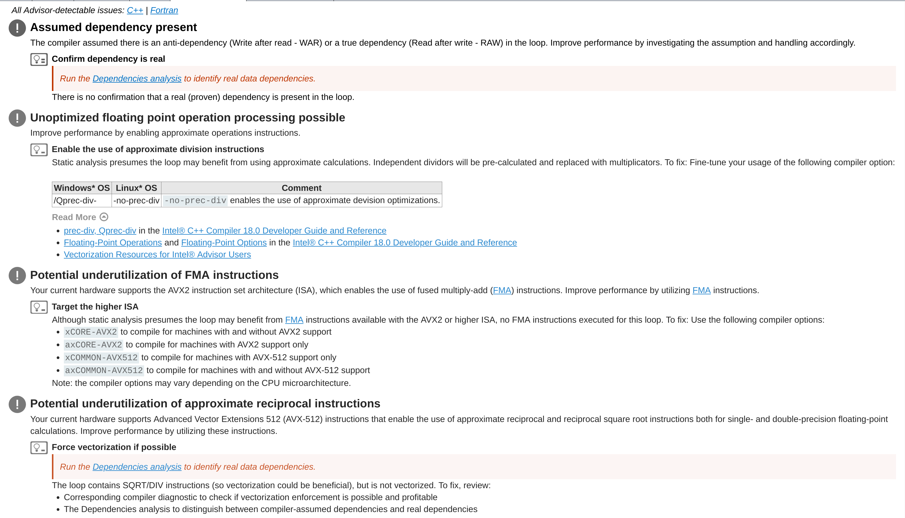
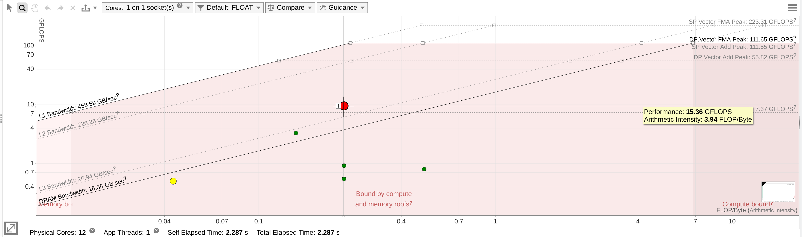

# Final Project

Comments about the final project for the P2.12_seed Intel course.

**Goal**: Analyze the [MPI heat equation C code](https://repository.prace-ri.eu/git/CodeVault/training-material/parallel-programming/MPI/-/tree/master/heat-equation/c) with the Intel tools:

- Intel Application Performance Snapshot (APS);
- Intel Advisor;
- Intel VTune

**Remark**: Since the latest versions of Intel Advisor and VTune do not work on our machines (due to C libraries being too recent), we had to work on Intel DevCloud. Users are only allowed to use two nodes per core on the DevCloud compute nodes. Moreover, in order to compile the full code the `libpng` library is necessary, therefore we had to install it on the compute nodes as follows:

- `qsub -l nodes=1:batch:ppn=2 -d . -I` (enter compute node interactively)
- `tar -xvf libpng-1.6.37.tar.xz` (in user home directory; tar file downloaded from [this site](https://sourceforge.net/projects/libpng/files/libpng16/1.6.37/))
- `cd libpng-1.6.37`
- `./configure --prefix=/home/u44098`
- `make check`
- `make install`

The Makefile had to be properly modified in order to include the path for the `libpng` header file during compilation, as well as the path for the `libpng` libraries during linking.

**Remark**: We will compile and run the code on DevCloud, but analyze the results on our local machines (especially because the GUI are not available on DevCloud).

**Remark**: We will collect performance data for the program run with both 1 and 2 MPI processes. This is because the 1 MPI process case will help us understand bottlenecks for the serial code, while the 2 MPI processes case will give us information about MPI communication bottlenecks.


## Application Performance Snapshot (APS)

To collect APS data, we first compile and run both the program and the APS analysis commands on a DevCloud compute node:

- `qsub -l nodes=1:batch:ppn=2 -d . -I`

- `make`

We then source the appropriate script for defining the relevant environment variables, run the program while collecting APS data for 1 MPI process, and create the APS report (removing at the end the generated .png and .dat files):

- `source /opt/intel/inteloneapi/vtune/2021.1-beta06/apsvars.sh `
- `mpirun -np 1 aps ./heat_mpi`
- `aps --report=/home/u44098/intel/aps_result_20200606`

- `rm *.png HEAT_RESTART.dat `

In addition we collect the APS data and report for a run with 2 MPI processes, to get some performance analysis on MPI communications; in order to also collect information about data transfers for rank-to-rank communication, we set the `APS_STAT_LEVEL` flag to an appropriate value:

- `export APS_STAT_LEVEL=4`
- `mpirun -np 2 aps ./heat_mpi` 
- `aps --report=/home/u44098/intel/aps_result_20200606`
- `aps-report -x --format=html aps_result_20200606`
- `rm *.png HEAT_RESTART.dat `

At this point we can download the APS html reports to our local machine and examine them. For the 1 MPI case we get the following report (see folder [v0_cloud](v0_cloud)):


As we can see, there is a little too much of memory stalls; moreover, the code spends a little too much time on MPI functions (mostly for I/O). More importantly, it seems like the code has not been vectorized at all.

**Remark**: As we will see from Advisor, actually two loops have been vectorized, but only the 0.6% of the total CPU time was spend in vectorized code. 

The report for the 2 MPI case is similar and presents the same issues:


We can also plot the data transfers matrix for rank-to-rank communication, from which it seems that there is some data transfer imbalance among processors:


**Remark**: Why is that so? 


## Intel Advisor

To perform a more detailed analysis, we run Intel Advisor. We will improve the compilation flags and the code in a step-by-step approach, following the suggestions from Advisor.

#### Version 0 - original code

First of all, we source the appropriate script for defining the relevant environment variables and we create the compiler optimization reports (i.e. we add the `-qopt-report=5 -qopt-report-phase=all` compilation flags) for the original code:

- `source /opt/intel/inteloneapi/advisor/2021.1-beta06/advixe-vars.sh`
- `make clean`
- `make REPORT=yes`

From those reports (see folder [v0](v0)), it seems that only the loop in `generate_field` at `setup.c 96` was vectorized, while all other loops in the rest of the code could not be vectorized due to vector dependencies or other problems. This seems compatible with the APS results, which were saying the code is basically not vectorized. We will have to resolve vector dependencies and all other problems (if possible) to be able to fully vectorize the code.

We then compile again without generating the optimization reports and run the Advisor commands for generating the necessary data to create the roofline model, for 1 MPI process:

- `make clean`
- `make`
- `mpirun -n 1 -gtool "advixe-cl -collect survey -no-auto-finalize -project-dir ./adv_v0_np1:0" ./heat_mpi`
- `rm *.png HEAT_RESTART.dat`
- `mpirun -n 1 -gtool "advixe-cl -collect tripcounts -flop -no-auto-finalize -project-dir ./adv_v0_np1:0" ./heat_mpi`
- `rm *.png HEAT_RESTART.dat`

**Remark**: If we use instead the (naively?) equivalent commands

- `mpirun -np 1 advixe-cl -collect survey -project-dir ./adv_v0_np1 -- ./heat_mpi`
- `mpirun -np 1 advixe-cl -collect tripcounts -flop -project-dir ./adv_v0_np1 -- ./heat_mpi`

we get some weird warning about missing symbols, the first of them being 

`advixe: Warning: The current result was collected on another host. For proper symbol resolution, please specify search directories for the binaries of interest using the -search-dir command line option or "Binary/Symbol Search" dialog in GUI.
 ` 

Using `--search-dir src:r=.` or other paths seems to fix the issue only partially; we did not understand how how to fix it completely.

Next we run the same commands for 2 MPI processes:

- `mpirun -n 2 -gtool "advixe-cl -collect survey -no-auto-finalize -project-dir ./adv_v0_np2:0-1" ./heat_mpi`
- `rm *.png HEAT_RESTART.dat`
- `mpirun -n 2 -gtool "advixe-cl -collect tripcounts -flop -no-auto-finalize -project-dir ./adv_v0_np2:0-1" ./heat_mpi`
- `rm *.png HEAT_RESTART.dat`

**Remark**: similarly to before, running

- `mpirun -np 2 advixe-cl -collect survey -project-dir ./adv_v0_np2 -- ./heat_mpi`

- `mpirun -np 2 advixe-cl -collect tripcounts -flop -project-dir ./adv_v0_np2 -- ./heat_mpi`

generates some warning about missing symbols.

We can now copy the collected information on our machine (reports + binaries and executable: just copy everything) and run (for 1 MPI process) 

`advixe-gui adv_v0_np1/adv_v0_np1.advixeproj >/dev/null 2>&1 `

**-- VERY IMPORTANT REMARKS (TOTAL MESS) --**

**Remark**: In order to correctly generate the reports on our machine, we need both the reports and the binaries + executable (not only the reports). Moreover, before selecting `rank.0` we should add the path to the binary and source files (which we also need to copy on our machine) at `File -> Project Properties -> Binary/Symbol Search` and  `File -> Project Properties -> Binary/Source Search`. 

**Remark**: Results can be different if you do select  `Use application directory as working directory` in `File -> Project Properties`! We decided not to select it, since it is not discussed in the documentation.

**Remark**: Results can be different if, instead of adding the path to the binary and source files (which we also need to copy on our machine) at `File -> Project Properties -> Binary/Symbol Search` and  `File -> Project Properties -> Binary/Source Search` before selecting `rank.0`, you first select `rank.0` and then add the paths and re-finalize the survey! In particular, this second way does not produce any recommendation! See also [this link](https://software.intel.com/content/www/us/en/develop/articles/analyzing-intel-mpi-applications-using-intel-advisor.html), section "Viewing the collected results in the GUI", where they say:

`Once you have collected your results, you will need to view them. The best way to do this is using the Intel Advisor GUI. If you specified the **–no-auto-finalize** option, it is important to open your project and then use **Project Properties** to set the paths to your binaries and sources. You need to do this BEFORE you open the results so we will be able to finalize them properly.`

**Remark**: Apparently, modifying the code and reports on DevCloud requires to erase and downloading everything again on our local machine (just delete the whole local folder with reports, binaries and executable and download everything again), otherwise the GUI reports will not be updated at all (or will be updated in the wrong way if we re-finalize the survey locally).

**-- END OF REMARKS --**

At this point we can click on `rank.0` and get our report for 1 MPI process:


##### 

As we can see, the code has been vectorized for two loops according to Intel Advisor, for a total of 0.6% of CPU time spent on vectorized code: this is compatible with the APS reports, which were saying that the code was basically not vectorized. This also agrees with the compiler optimization reports. 

The Advisor report tells us that most of the loops were not vectorized and provides possible reasons for that; it also tells us that one of the two vectorized loops has some performance issue. Let us go through all the problematic loops one by one:

**Vectorized loops**

- The loop in `generate_field` at `setup.c 96` was vectorized but has some issue due to multiple data types in the loop of different bit length: 

**Not vectorized loops**

- The loop in `evolve_interior` at `core.c 68`, as well as the four loops in `evolve_edges` at `core.c 101, 116, 131, 146`, appear to have dependencies (as we already know from the compiler optimization reports and, implicitly, from APS). Moreover, Advisor tells us that we may optimize the code by using approximate division instructions with the `-no-prec-div` flag; in addition, we could better use FMA instructions and approximate reciprocal instructions by utilizing AVX-512 rather than AVX2 (which is the default with the `-O2` compilation flag), for example with the `-xCORE-AVX512 -qopt-zmm-usage=high` compilation flags:

  

- The outer loop in `initialize` at `setup.c 95` was not vectorized since the inner loop was already vectorized; 
- The loops in `write_field` at `io.c 34` and in `main` at `main.c 49` were not vectorized because the  loop control variable was found, but the loop iteration count could not be computed before executing the loop (i.e. we have to be more explicit in declaring when to terminate the loops);
- The loop in `save_png` at `pngwriter.c 151` was not vectorized since a non-vectorized and non-inlined user-defined function is called in the loop:

- The loop in `save_png` at `pngwriter.c 144` was not vectorized since a compile time constraint prevented loop optimization (i.e. we should use `-O3` or higher, rather than `-O2`);
- The outer loop in `evolve_interior` at `core.c 67` was not auto-vectorized and requires us to force vectorization (i.e. using SIMD or AVX vector directives).

We should therefore fix the problems that prevent vectorization for the non-vectorized loops, and also resolve the performance problems for the already vectorized loops.

For 2 MPI processes we run instead

`advixe-gui adv_v0_np2/adv_v0_np2.advixeproj >/dev/null 2>&1 `

In this case we have two folders `rank.0` and `rank.1`. Before selecting either of them, we have to add the appropriate paths as explained above. The `rank.0` report looks as follows:


**Remark**: Interestingly, rank 0 sees AVX but not AVX2 (while as we can see just below, rank 1 also sees AVX2); it is not clear to us the reason for this behavior.

The `rank.1` report is similar, even if rank 1 obviously does not call all of the functions:


The conclusions we can obtain from the 2 MPI reports are similar to the 1 MPI case.


#### Version 1 - AVX-512 and other compilation flags

Before trying to fix vector dependencies and other issues, which may require modifications of the code, we change only the Makefile and add the compilation flags `-Ofast -xCORE-AVX512 -qopt-zmm-usage=high -no-prec-div`  that turn on AVX-512, approximate divisions and other optimizations as suggested by the previously seen Advisor reports (notice that we replace `-O2` with `-Ofast`). 

The commands are basically the same as before; for 1 MPI process:

- `make clean`
- `make REPORT=yes`
- `mpirun -n 1 -gtool "advixe-cl -collect survey -no-auto-finalize -project-dir ./adv_v1_np1:0" ./heat_mpi`
- `rm *.png HEAT_RESTART.dat`
- `mpirun -n 1 -gtool "advixe-cl -collect tripcounts -flop -no-auto-finalize -project-dir ./adv_v1_np1:0" ./heat_mpi`
- `rm *.png HEAT_RESTART.dat`

For 2 MPI processes:

- `mpirun -n 2 -gtool "advixe-cl -collect survey -no-auto-finalize -project-dir ./adv_v1_np2:0-1" ./heat_mpi`
- `rm *.png HEAT_RESTART.dat`
- `mpirun -n 2 -gtool "advixe-cl -collect tripcounts -flop -no-auto-finalize -project-dir ./adv_v1_np2:0-1" ./heat_mpi`
- `rm *.png HEAT_RESTART.dat`

The Advisor report for 1 MPI process looks like follows:


More loops are now vectorized, but there still are some performance issue and some not vectorized loops:

**Vectorized loops**

- The loop in `generate_field` at `setup.c 96`, which was already vectorized, has more issues than before: now Advisor tells us that not only there are multiple data types in the loop of different bit length, but memory access may also be inefficient. 

- The loop in `evolve_interior` at `core.c 68` and the loop in `evolve_edges` at `core.c 101` have been vectorized but have ineffective peeled or remainder loop:

  **Remark:** The loop in `evolve_edges` at `core.c 116` no longer appears: the reason for this behavior is unclear. Moreover, from the compilation report it seems it has not been vectorized; this is very weird since it is identical to the loop in `evolve_edges` at `core.c 101`, apart from having a different value of `i`:

  ```c
  # loop at 101
  
  i = 1;
  for (j = 1; j < curr->ny + 1; j++) {
      ic = idx(i, j, width);
      iu = idx(i+1, j, width);
      id = idx(i-1, j, width);
      ir = idx(i, j+1, width);
      il = idx(i, j-1, width);
      curr->data[ic] = prev->data[ic] + a * dt *
                         ((prev->data[iu] -
                           2.0 * prev->data[ic] +
                           prev->data[id]) / dx2 +
                          (prev->data[ir] -
                           2.0 * prev->data[ic] +
                           prev->data[il]) / dy2);
  }
  
  # loop at 116
  
  i = curr -> nx;
  for (j = 1; j < curr->ny + 1; j++) {
      ic = idx(i, j, width);
      iu = idx(i+1, j, width);
      id = idx(i-1, j, width);
      ir = idx(i, j+1, width);
      il = idx(i, j-1, width);
      curr->data[ic] = prev->data[ic] + a * dt *
                         ((prev->data[iu] -
                           2.0 * prev->data[ic] +
                           prev->data[id]) / dx2 +
                          (prev->data[ir] -
                           2.0 * prev->data[ic] +
                           prev->data[il]) / dy2);
  ```
  

- The loops in `evolve_edges` at `core.c 131, 146` have been vectorized but may have inefficient memory access patterns: 

  

**Not vectorized loops**

- The outer loop in `initialize` at `setup.c 95` was not vectorized since the inner loop was already vectorized. Moreover, it presents data type conversions that may affect performance.

- The outer loop in `evolve_interior` at `core.c 67` was not vectorized since the inner loop was already vectorized.

- The loops in `write_field` at `io.c 34` , in `main` at `main.c 49` and in `save_png` at `pngwriter.c 144` were not vectorized because the  loop control variable was found, but the loop iteration count could not be computed before executing the loop (i.e. we have to be more explicit in declaring when to terminate the loops).

- The loop in `save_png` at `pngwriter.c 151` was not vectorized since a non-vectorized and non-inlined user-defined function is called in the loop, and there may also be dependencies:

  


The Advisor result for 2 MPI processes is again divided into two ranks. For `rank.0` we have:

**(TO BE COMPLETED)**


#### Version 2 - Improving core.c and setup.c

Let us now try to improve the code more, even modifying it if necessary, following the suggestions by Advisor we listed above. For the moment, let us focus on the source code in `core.c` and `setup.c`, which involve the main computational loops. We will add the following modifications:

-  We disable dynamic alignment by adding the `#pragma vector nodynamic_align` in the `evolve_interior` at `core.c 68` and `evolve_edges` at `core.c 101, 116` loops;

- We improve memory access for the loop in  `generate_field` at `setup.c 96` by modifying the code. The original code looks like:

  ```c
  if (dx * dx + dy * dy < radius * radius) 
  { temperature->data[ind] = 5.0; } 
  else 
  { temperature->data[ind] = 65.0; }
  ```

  This is probably not accessing memory efficiently because of the `if` statement; we therefore replace it by

  ```c
  temperature->data[ind] = 5.0 + 0.5*(sign(dx*dx + dy*dy - radius*radius) + 1.0)*60.0;
  ```

  where we defined

  ```c
  double sign(float x){ return (x > 0) - (x < 0);} 
  ```

- Other trials which led to unsuccessful results are not reported (or briefly mentioned).


The commands to generate the reports are the same as before, with the only difference being the name of the report folder; for 1 MPI process:

- `make clean`
- `make REPORT=yes`
- `mpirun -n 1 -gtool "advixe-cl -collect survey -no-auto-finalize -project-dir ./adv_v2_np1:0" ./heat_mpi`
- `rm *.png HEAT_RESTART.dat`
- `mpirun -n 1 -gtool "advixe-cl -collect tripcounts -flop -no-auto-finalize -project-dir ./adv_v2_np1:0" ./heat_mpi`
- `rm *.png HEAT_RESTART.dat`

For 2 MPI processes:

- `mpirun -n 2 -gtool "advixe-cl -collect survey -no-auto-finalize -project-dir ./adv_v2_np2:0-1" ./heat_mpi`
- `rm *.png HEAT_RESTART.dat`
- `mpirun -n 2 -gtool "advixe-cl -collect tripcounts -flop -no-auto-finalize -project-dir ./adv_v2_np2:0-1" ./heat_mpi`
- `rm *.png HEAT_RESTART.dat`

The Advisor report for 1 MPI process looks like follows:





Let us comment on the results:

**Vectorized loops**

- For the loop in `generate_field` at `setup.c 96` we were able to improve memory access by modifying the code as described above, thus bringing its vector efficiency from 90% to 100%. However, we were not able to solve the problem of multiple data types of different length in the loop (actually we worsened it a bit). 

  **Remark**: Can we fix this problem or it is due to how the various structs are defined?

 

- Adding `#pragma vector nodynamic_align` was enough to solve the ineffective peeled or remainder loop problem in `evolve_interior` at `core.c 68` and in `evolve_edges` at `core.c 101, 116`.

  **Remark:** The loop in `evolve_edges` at `core.c 116` does not appear again. Moreover, following the compiler reports we noticed that it was not vectorized and we had to force vectorization with `#pragma omp simd`, adding also `-qopenmp-simd` in the Makefile. This is extremely weird since it is the same loop as `core.c 101`, only with a different value of `i`.

- The loops in `evolve_edges` at `core.c 131, 146` are still vectorized but with inefficient memory access patterns. It seems to us that this problem cannot be fixed, simply because there is no way of accessing memory continuously in C when evolving the vertical edges of the problem domain; this is clear by comparing for example the loops at `101` and `131`:

  ```c
  # Loop at 101
  
  i = 1;
  for (j = 1; j < curr->ny + 1; j++) {
      ic = idx(i, j, width);
      iu = idx(i+1, j, width);
      id = idx(i-1, j, width);
      ir = idx(i, j+1, width);
      il = idx(i, j-1, width);
      curr->data[ic] = prev->data[ic] + a * dt *
                         ((prev->data[iu] -
                           2.0 * prev->data[ic] +
                           prev->data[id]) / dx2 +
                          (prev->data[ir] -
                           2.0 * prev->data[ic] +
                           prev->data[il]) / dy2);
  }
  
  # Loop at 131
  
  j = 1;
  for (i = 1; i < curr->nx + 1; i++) {
      ic = idx(i, j, width);
      iu = idx(i+1, j, width);
      id = idx(i-1, j, width);
      ir = idx(i, j+1, width);
      il = idx(i, j-1, width);
      curr->data[ic] = prev->data[ic] + a * dt *
                         ((prev->data[iu] -
                           2.0 * prev->data[ic] +
                           prev->data[id]) / dx2 +
                          (prev->data[ir] -
                           2.0 * prev->data[ic] +
                           prev->data[il]) / dy2);
  ```
  

**Not vectorized loops**

- As before, the outer loop in `evolve_interior` at `core.c 67` was not vectorized since the inner loop was already vectorized. Actually, trying to vectorize both inner and outer loops results in a  decreased  time in scalar code, but also decreases vectorization gain while increasing a lot the total CPU time (15.48 s compared to the previous 3.84 s), as we can see in the images below. This is most likely due to inefficient memory access patterns of the outer loop. For these reasons, we prefer to leave the outer loop not vectorized. 

  

  

  

- The outer loop in `initialize` at `setup.c 95` presents data type conversions that may affect performance, which we were not able to fix (it is actually the same problem as `setup.c 96` since this is its outer loop). Moreover, it was not vectorized since the inner loop was already vectorized: however, vectorizing it is inconvenient for the same reasons discussed in the previous point.

- The loops in `write_field` at `io.c 34` , in `main` at `main.c 49` and in `save_png` at `pngwriter.c 144` were not touched, therefore are still not vectorized because the  loop control variable was found, but the loop iteration count could not be computed before executing the loop (i.e. we have to be more explicit in declaring when to terminate the loops).

- The loop in `save_png` at `pngwriter.c 151` was not touched, therefore is still not vectorized since a non-vectorized and non-inlined user-defined function is called in the loop, and there may also be dependencies:

  


The Advisor result for 2 MPI processes is divided into two ranks. For `rank.0` we have:

**(TO BE COMPLETED)**