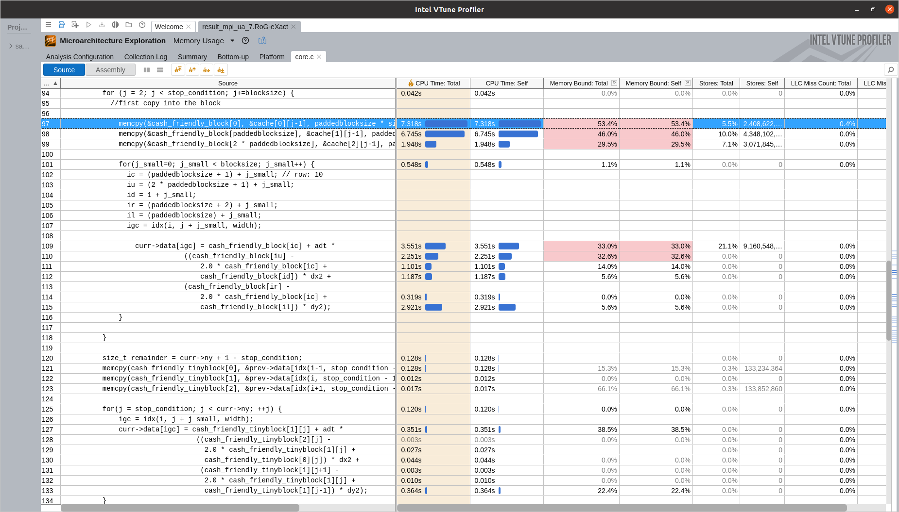
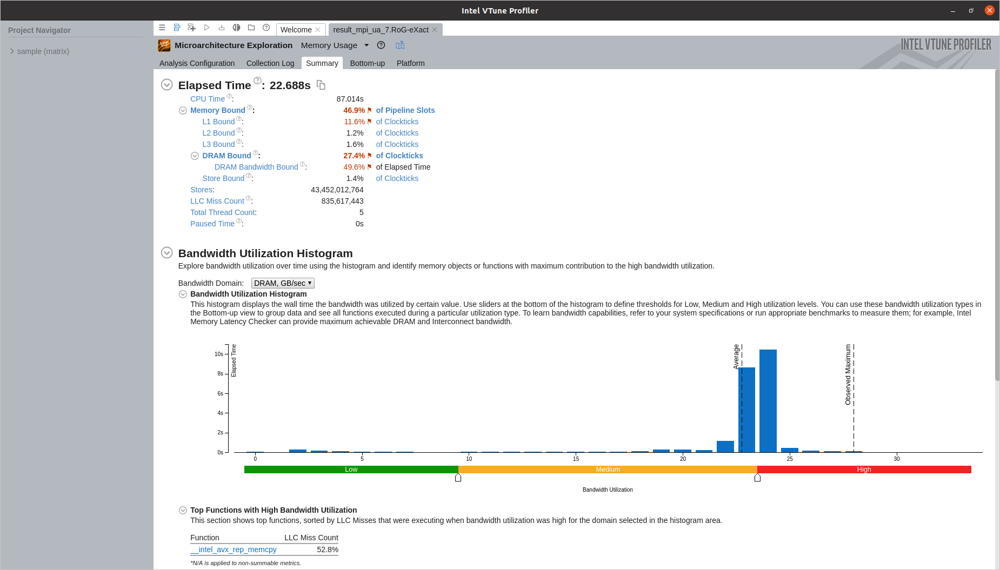

## VTune analysis

First, the code has been run under VTune on DevCloud "cluster" and we obtained the following picture:  

 

As we can see, VTune marks the most CPU consuming task as "Outside any known module", and lots of lines are grayed out and marked "unreliable" when pointed with a mouse. It looks like we do not have proper access to hardware counters on Intel machine, so we went to a local laptop to see more detailed results. Thus the following picture has been obtained:

Now we do not have any "Outside any known module" and can see that the function "evolve interior" does, in fact, consume the most resources. Here are the few summaries that VTune gave us:

If we ask to show which line of code takes the most, we, unsurprisingly, obtain the following:

We have tried to modify the loop and only got slower results:

