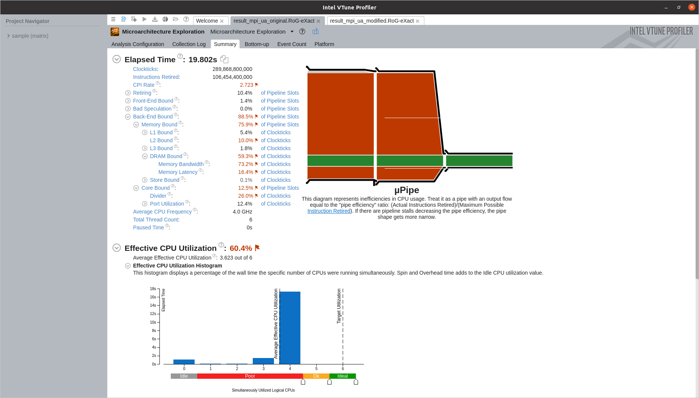
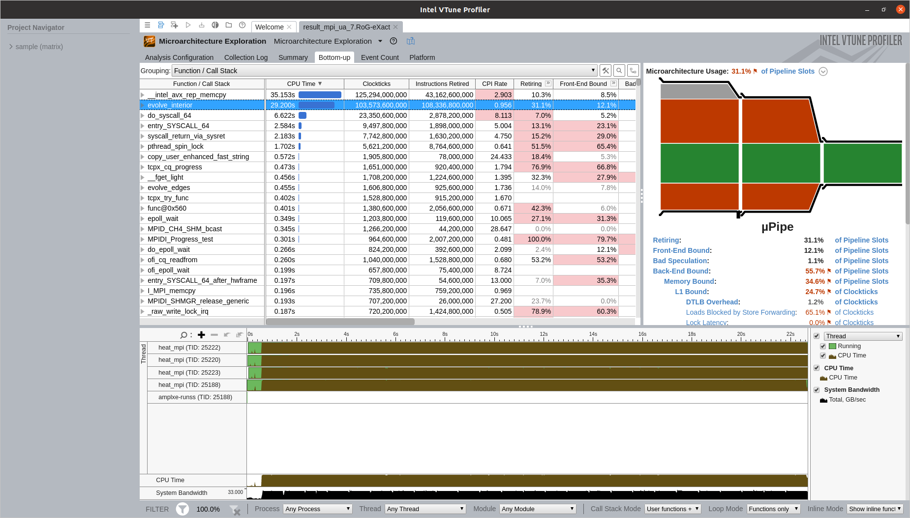

## VTune analysis

### A brief introduction

It's a tool focused on-node analysis which
allows to explore application hotspots and resource exploitation, such as
bandwidth, cores, and microarchitecture.

We want to use VTune to find the exact hotspots in our program and see if they come from CPU or memory utilization. 

First, the code has been run under VTune on DevCloud "cluster" (which allowed us to ask for maximum of 4 nodes and 2 cores on each), using the command:

### Commands

For microarchitecture analysis:

```bash
REPO=P2.13_Final_Assignment
mpirun -np 8 vtune -collect uarch-exploration -knob collect-memory-bandwidth=true -trace-mpi -result-dir result_mpi_ua -app-working-dir /home/${USER}/${REPO}/heat-equation/c -- /home/${USER}/${REPO}/heat-equation/c/heat_mpi
```

For hotspot analysis:

```bash
REPO=P2.13_Final_Assignment
mpirun -np 8 vtune -collect hotspots -k sampling-mode=hw -trace-mpi -result-dir result_mpi -app-working-dir /home/${USER}/${REPO}/heat-equation/c -- /home/${USER}/${REPO}/heat-equation/c/heat_mpi
```

### Results 

The first attempt was running the code on the following environment:

* OS: Ubuntu 18.04
* Intel OneAPI: 2020 Beta 7
* Processor: Intel(R) Xeon(R) Gold 6128 CPU @ 3.40GHz
* RAM: 188 GB
* Vector ISA: AVX512

After running the commands, we obtained the following picture:  

 

VTune marks the most CPU consuming task as "Outside any known module", and lots of lines are grayed out and marked "unreliable" when pointed with a mouse. But we already know from the Advisor that we should expect "evolve_interior" to be a hotspot and not some outside module. It looks like we do not have proper access to hardware counters on Intel machine, so we went to a local laptop to see more detailed results:

* OS: Ubuntu 20.04
* Intel OneAPI: 2020 Beta 7
* Processor: Intel Core i7 9750H (6 cores)
* RAM: 16GB RAM
* Vector ISA: AVX2

We ran it with the similar command: 

```bash
mpirun -np 4 vtune -collect uarch-exploration -knob collect-memory-bandwidth=true -trace-mpi -result-dir result_mpi_ua_modified -app-working-dir /home/${USER}/${REPO}/heat-equation/c -- /home/${USER}/${REPO}/heat-equation/c/heat_mpi
```

Thus the following picture has been obtained:


Now we do not have any "Outside any known module" and can see that the function "evolve interior" does, in fact, consume the most resources. Here are the few summaries that VTune gave us:


We see that the bandwidth we get is rather high, around 28 GB/sec out of 33 GB/s (~85%). This suggests that the bandwidth is really exploited by the application.


The CPU utilization seems low, but that is because the software detects all available CPUs while we couldn't run the code on 6 cores due to how the distribution of the data is implemented. So we were only using 4 cores and got effective utilization of 3.623 (90.5%).


Now lets look at our memory usage:




We see that the application is memory bound and the most time is spent accessing DRAM.

If we ask to show which line of code takes the most, we, unsurprisingly, obtain the following:


We have tried to modify the loop (doing simple modification like taking all the common factors out of the loops) and only got slightly slower results with higher cpi rate. Apparently, compiler is able to modify simple loops better than us. 

Original code: [core.c](code/c/core.orig.c)

Modified code: [core.c](code/c/core.mod1.c)

```c
  dx2_inv =(a*dt)/( prev->dx * prev->dx);
  dy2_inv =(a*dt)/( prev->dy * prev->dy);
  for (i = 2; i < curr->nx; i++) {
#pragma vector nodynamic_align
      for (j = 2; j < curr->ny; j++) {
          id = idx(i-1, j, width);
          il = idx(i, j-1, width);
          ic = idx(i, j, width);
          ir = idx(i, j+1, width);
          iu = idx(i+1, j, width);

    double id_d = prev->data[id];
    double il_d = prev->data[il];
    double ic_d = prev->data[ic];
    double ir_d = prev->data[ir];
    double iu_d = prev->data[iu];

          curr->data[ic] = ic_d +   ((iu_d - 2.0 * ic_d + id_d) * dx2_inv +
                              (ir_d - 2.0 * ic_d + il_d) * dy2_inv);
      }
  }
```


But overall we see that nothing changed much and we are still heavily memory bound. We know that the problem comes from accessing a different raw when doing stencil calculations.

So, we decided to use the idea of "fast matrix transpose" and first copy part of the memory into smaller arrays that are much more cache-friendly. This became, however, a great illustration to why sometimes it's better to not try optimizing...

The following approach for rearrangement was used:


Original code: [core.c](code/c/core.orig.c)

Modified code: [core.c](code/c/core.c)

```c
void evolve_interior(field *curr, field *prev, double a, double dt) {
  /*...*/

  /* Block decomposition*/
  const int blocksize = 64;
  const int row_width = 2000;

  const int paddedblocksize = blocksize + 2;

  double cache_friendly_block[3 * paddedblocksize] __attribute__((aligned(64)));
  double cache_friendly_tinyblock[3][paddedblocksize]
      __attribute__((aligned(64)));

  /* Row decomposition */
  double *cache[3];
  cache[0] = (double *)_mm_malloc(row_width * sizeof(double), 64);
  cache[1] = (double *)_mm_malloc(row_width * sizeof(double), 64);
  cache[2] = (double *)_mm_malloc(row_width * sizeof(double), 64);

  dx2 = 1. / (prev->dx * prev->dx);
  dy2 = 1. / (prev->dy * prev->dy);

  // total_steps - (total_steps % 8)
  ssize_t stop_condition = ((curr->ny - 2) & (-blocksize)) + 2;

  double adt = a * dt;
  for (i = 2; i < curr->nx; i++) {

    /* Perform by row decomposition */
    memcpy(cache[0], &prev->data[idx(i - 1, 0, width)],
           curr->ny * sizeof(double));
    memcpy(cache[1], &prev->data[idx(i, 0, width)], curr->ny * sizeof(double));
    memcpy(cache[2], &prev->data[idx(i + 1, 0, width)],
           curr->ny * sizeof(double));

    for (j = 2; j < stop_condition; j += blocksize) {

      /* Perform by block decomposition */
      memcpy(&cache_friendly_block[0], &cache[0][j - 1],
             paddedblocksize * sizeof(double));
      memcpy(&cache_friendly_block[paddedblocksize], &cache[1][j - 1],
             paddedblocksize * sizeof(double));
      memcpy(&cache_friendly_block[2 * paddedblocksize], &cache[2][j - 1],
             paddedblocksize * sizeof(double));

      for (j_small = 0; j_small < blocksize; j_small++) {
        /* Ops */
      }
    }

    /* Handle remainder */
    size_t remainder = curr->ny + 1 - stop_condition;
    memcpy(cache_friendly_tinyblock[0],
           &prev->data[idx(i - 1, stop_condition - 1, width)], remainder);
    memcpy(cache_friendly_tinyblock[1],
           &prev->data[idx(i, stop_condition - 1, width)], remainder);
    memcpy(cache_friendly_tinyblock[2],
           &prev->data[idx(i + 1, stop_condition - 1, width)], remainder);

    for (j = stop_condition; j < curr->ny; ++j) {
      igc = idx(i, j + j_small, width);
      curr->data[igc] = cache_friendly_tinyblock[1][j] +
                        adt * ((cache_friendly_tinyblock[2][j] -
                                2.0 * cache_friendly_tinyblock[1][j] +
                                cache_friendly_tinyblock[0][j]) *
                                   dx2 +
                               (cache_friendly_tinyblock[1][j + 1] -
                                2.0 * cache_friendly_tinyblock[1][j] +
                                cache_friendly_tinyblock[1][j - 1]) *
                                   dy2);
    }
  }

  _mm_free(cache[0]);
  _mm_free(cache[1]);
  _mm_free(cache[2]);
}
```

The overall time actually went up from 19 to 22 seconds, but we are not so DRAM bound anymore.


We can see that we actually lowered the bandwidth from 28 GB/s to 24 GB/s:


So, at the end we see that we moved the problem from evolve_interior to memcpy (which now has to move the memory and use CPU resources for that):



A possible future optimization attempt is to design the algorithm thinking in a by block processing approach, in order to maximise the scalability of the code and also avoid a large amount of Last Level of Cache (LLC) misses.


## Conclusions:

- VTune showed us where the hotspot was and that the application was memory bound with lots of cache-misses. This was the caused by the memory access pattern and the amount of data accesed.

- We implemented a memcpy-based rearrangement, thus getting rid of cache misses, but the overall run time increased around 16 % due to spending time on memory rearrangements. This should be analysed in the future to look for possible optimizations.

- There are two possible activities to do for future work: implement AVX with intrinsics and globally redesign the algorithm to work in batches from the start.
