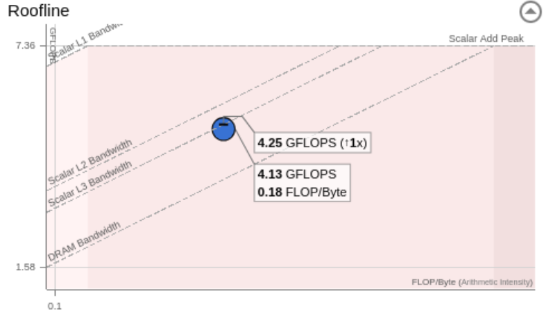
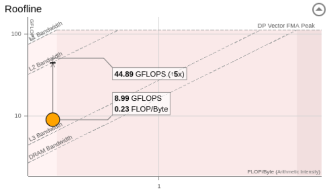
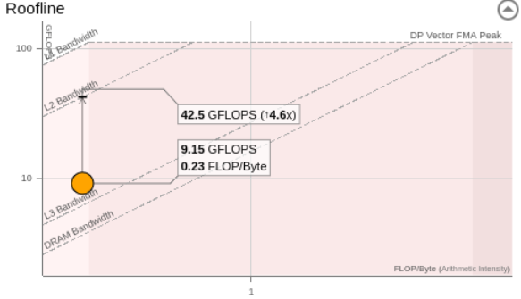

# Optimisation Reports

## Compiler level optimisation

### Baseline

The initial version before any optimisation:

| Criteria               | Result       |
|------------------------|--------------|
| GFLOP/s                | 3.47         |
| GINTOPS/s              | 0.70         |
| FP Arithm. Intensity   | < 0.001      |
| CPU total time         | 5.08s        |
| Time in scalar         | 5.05s        |
| Time in vectors        | 0.03s        |
| Vectorisation          | SSE to AVX2  |
| Vector efficiency      | 88%          |

The recommendations:

> Turn on the AVX-512 through `-xCORE-AVX512`

> Assuming dependency: evolve_edges in `core.c:101` and `core.c:131`

> FMA instructions underutilisation: This suggests to use the flag of AVX-512

> And others related to AVX-512

The roofline:

### Using `-xCORE-AVX512` flag

The initial version before any optimisation:

| Criteria               | Result       |
|------------------------|--------------|
| GFLOP/s                | 6.68         |
| GINTOPS/s              | 0.48         |
| FP Arithm. Intensity   | < 0.001      |
| CPU total time         | 2.69s        |
| Time in scalar         | 0.19s        |
| Time in vectors        | 2.50s        |
| Vectorisation          | SSE2-AVX512  |
| Vector efficiency      | 86%          |

The recommendations:

> Turn on the `zmm` registers: use `-xCORE-AVX512 -qopt-zmm-usage=high`

The roofline:

### Using `-xCORE-AVX512 -qopt-zmm-usage=high` flags

The initial version before any optimisation:

| Criteria               | Result       |
|------------------------|--------------|
| GFLOP/s                | 6.79         |
| GINTOPS/s              | 0.25         |
| FP Arithm. Intensity   | < 0.001      |
| CPU total time         | 2.65s        |
| Time in scalar         | 0.20s        |
| Time in vectors        | 2.45s        |
| Vectorisation          | AVX-AVX512   |
| Vector efficiency      | 87%          |

The recommendations:

- None

The roofline:

Some observations:

- The most consuming loops are: core.c:68 (greatest), core.c:67, core.c:131, 
core.c:112, core.c:101

For all the pictures, please have a look at the folder: `img/compiler_level_opt/`

